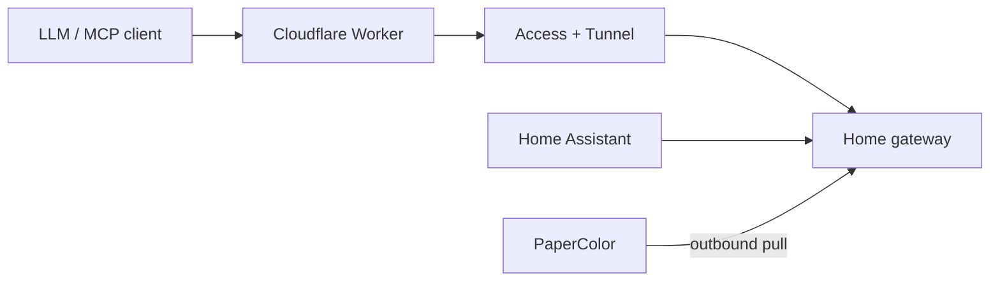

# PaperColor Pulse

Turn an M5Stack PaperColor C151 into a low-power, three-page LLM Pulse display.

PaperColor Pulse combines:

- ESP32-S3 firmware with local Wi-Fi onboarding, page navigation, RTC wakeups,
  environmental telemetry, microSD caching, RGB/audio feedback, and optional
  voice capture;
- a self-hosted Python gateway that renders deterministic 400 x 600 e-paper
  pages and queues immediate or scheduled cards;
- a Home Assistant package that publishes factual weather data;
- an optional Cloudflare Worker that exposes a small authenticated MCP surface
  without exposing the device or home LAN to inbound Internet traffic.



## Stable features

- Three Pulse pages: environment, work, and ideas.
- Side B/A buttons navigate previous/next; top C double-click synchronizes.
- Normal updates use a configurable low-power polling interval.
- Scheduled cards are cached in advance and displayed from an RTC alarm.
- Sensor facts and model-written notes are separate data namespaces.
- Four MCP tools: `papercolor_show_card`, `papercolor_update_pulse`,
  `get_environment`, and `papercolor_list_ideas`.
- Home Assistant publishes weather without an LLM call.

Voice recording is experimental. WAV capture to microSD is implemented, but
automatic transcription is intentionally not part of the beginner setup.

## Hardware

- M5Stack PaperColor C151
- USB-C data cable
- 2.4 GHz Wi-Fi
- Optional microSD card
- A Linux, macOS, NAS, or mini-PC that can run the gateway

## Choose your path

### Path A: local only

Use this first. The device and gateway remain on your home network. You can
open the local photo page, publish facts, and test the gateway without any
Cloudflare account.

### Path B: model access through Cloudflare

After Path A works, deploy the included Worker and a Cloudflare Tunnel. Your
model calls the Worker MCP endpoint; the Worker authenticates and forwards only
four allowlisted tools to the gateway. The ESP32 still accepts no public inbound
connection.

## 1. Clone and build the firmware

Install ESP-IDF 5.5.x, then:

```bash
git clone --recurse-submodules https://github.com/yanyichiang/papercolor-pulse.git
cd papercolor-pulse
. "$IDF_PATH/export.sh"
idf.py set-target esp32s3
idf.py build
./tools/flash.sh full
```

When prompted, hold the side power/download button until the USB download port
appears, then release it. The helper writes at a conservative baud rate,
verifies the flash hash, and starts the app with a watchdog reset.

On first boot, join the temporary `PaperColor-XXXXXX` Wi-Fi network and select
your home 2.4 GHz network. If captive-portal onboarding is unreliable, use:

```bash
python3 tools/provision_wifi.py --ssid 'YOUR_WIFI_NAME'
```

The script asks for the password without placing it in process arguments.

## 2. Start the gateway

The easiest route generates two distinct random tokens, stores them in a
mode-600 `.env`, builds the container, and waits for health:

```bash
./gateway/scripts/quickstart.sh
```

For manual setup, copy `gateway/config/example.env` to `gateway/.env`, then
generate two different random tokens:

```bash
python3 -c 'import secrets; print(secrets.token_urlsafe(48))'
python3 -c 'import secrets; print(secrets.token_urlsafe(48))'
```

Set one as `PAPERCOLOR_DEVICE_TOKEN` and the other as
`PAPERCOLOR_ADMIN_TOKEN`, then run from `gateway/`:

```bash
docker compose up -d --build
curl http://127.0.0.1:8767/health
```

Do not expose port 8767 directly to the public Internet.

## 3. Point the device at the gateway

Provision Wi-Fi and gateway settings together:

```bash
set -a; . gateway/.env; set +a
export PAPERCOLOR_GATEWAY_URL='http://192.168.1.20:8767'
python3 tools/provision_wifi.py --ssid 'YOUR_WIFI_NAME'
```

Use the LAN address of the machine running the gateway. The device stores the
configuration in NVS and actively pulls its manifest and assets.

## 4. Add Home Assistant weather

Copy `integrations/home-assistant/papercolor_pulse.yaml` into your HA packages
directory. Edit the two occurrences of `weather.home` to your weather entity.

Add to `secrets.yaml`:

```yaml
papercolor_gateway_ha_source_url: http://GATEWAY_LAN_IP:8767/admin/v1/pulse/sources/ha
papercolor_gateway_admin_authorization: Bearer YOUR_ADMIN_TOKEN
```

Enable packages if needed, restart Home Assistant, and run the automation once.
See [docs/home-assistant.md](docs/home-assistant.md) for UI steps and checks.

## 5. Test MCP locally

```bash
curl -sS http://127.0.0.1:8767/mcp \
  -H "Authorization: Bearer $PAPERCOLOR_ADMIN_TOKEN" \
  -H 'Content-Type: application/json' \
  --data '{"jsonrpc":"2.0","id":1,"method":"tools/list","params":{}}'
```

The response should contain exactly four tools. `papercolor_update_pulse` can
write only `assistant_note` and optional `focus_summary`; it cannot replace
temperature, humidity, weather, quota, task, storage, or timestamp facts.

## 6. Add the Cloudflare MCP endpoint

Follow [docs/cloudflare.md](docs/cloudflare.md). The short version is:

1. create a Cloudflare Tunnel hostname that reaches the gateway;
2. protect that hostname with an Access Service Auth policy;
3. deploy `cloudflare/` with the origin URL as a non-secret variable;
4. set four Worker secrets;
5. give your MCP client the Worker URL and client bearer.

The public endpoint is `https://YOUR_WORKER_DOMAIN/mcp`.

## Button map

| Button | Action |
|---|---|
| Side upper B | Previous page |
| Side lower A | Next page; hold 5 seconds to re-enter onboarding |
| Top C single | Start/stop experimental voice recording |
| Top C double | Synchronize the gateway immediately |

## Security model

- The device makes outbound LAN requests; it has no public inbound port.
- Device and admin tokens are distinct and must be at least 32 characters.
- The Cloudflare Worker has its own client token and tool allowlist.
- Cloudflare Access is an optional outer identity layer, not a replacement for
  application authentication.
- Model text and factual sources are validated by separate schemas.
- Remote images are HTTPS-only, size-limited, redirect-limited, and protected
  against private-address fetches and DNS rebinding.

## Development

Gateway tests:

```bash
cd gateway
uv sync --extra test
uv run pytest
```

Cloudflare tests:

```bash
cd cloudflare
npm install
npm test
npm run typecheck
```

Firmware build:

```bash
. "$IDF_PATH/export.sh"
idf.py build
```

## Privacy before publishing a fork

Run:

```bash
./tools/public-privacy-scan.sh
```

Also inspect screenshots, Git history, issue text, workflow logs, and release
assets. A clean current tree does not guarantee clean history.

## License and attribution

This project is based on M5Stack's MIT-licensed PaperColor user demo and uses
MIT-licensed M5Unified and M5GFX components. See [LICENSE](LICENSE) and
[NOTICE](NOTICE). Contributions to this repository are provided under the MIT
License unless stated otherwise.
