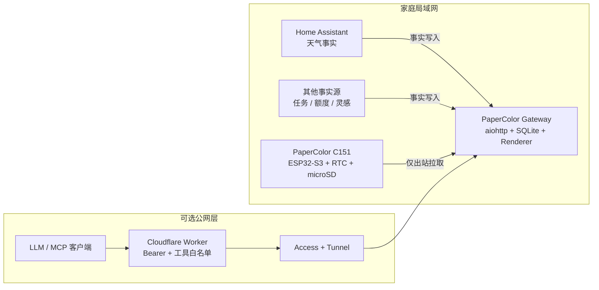

<div align="center">

# PaperColor Pulse

**把 M5Stack PaperColor C151 变成安静、低功耗、可由 LLM 持续更新的实体 Pulse 终端。**

[](https://github.com/yanyichiang/papercolor-pulse/actions/workflows/ci.yml)
[](LICENSE)
[](https://docs.espressif.com/projects/esp-idf/)
[](docs/home-assistant.md)
[](docs/cloudflare.md)

[English](README.en.md) · [快速开始](#快速开始) · [Home Assistant](docs/home-assistant.md) · [Cloudflare / MCP](docs/cloudflare.md) · [Issues](https://github.com/yanyichiang/papercolor-pulse/issues)

</div>

---

PaperColor Pulse 不是普通电子相册，也不是需要持续亮屏的控制面板。它把电子纸变成 LLM 的低干扰输出界面：设备定期低功耗唤醒，从家庭网关拉取已经排版好的三页 Pulse；重要内容还可以通过 RTC 在指定时间准点显示。

**事实与表达严格分离。** 天气、温湿度、时间、任务和额度来自确定性数据源；模型只能写关心文本与关注摘要，不能改写事实。

## 功能概览

| 能力 | 状态 | 说明 |
|---|:---:|---|
| 三页 Pulse | 稳定 | 环境、工作、灵感；400 × 600 确定性渲染 |
| 低功耗同步 | 稳定 | 周期唤醒拉取，无变化时避免无意义刷新 |
| RTC 定时卡片 | 稳定 | 提前缓存资源，到点唤醒显示 |
| Home Assistant | 稳定 | 不调用 LLM，定时发布天气事实 |
| MCP | 稳定 | 四个精确 allowlist 工具 |
| microSD | 稳定 | 页面缓存、状态与录音 outbox |
| 录音 | 实验性 | WAV 可写入 microSD，自动转录暂未纳入新手流程 |
| Cloudflare 入口 | 可选 | Worker + Tunnel + Access，设备仍无公网入站端口 |

### 三页信息架构

| 页面 | 内容 | 数据所有者 |
|---|---|---|
| 现在 | 日期、时间、温湿度、天气、简短关心 | 设备 / HA / Assistant |
| 工作 | 额度、当前任务、最近成果 | 外部事实源 |
| 灵感 | 最近灵感、录音与 microSD 状态 | 网关 / 设备 |

## 系统架构



设计原则：

1. **设备主动拉取：** ESP32 不监听公网端口。
2. **页面提前渲染：** 网关生成固定尺寸图片，设备只负责可靠下载和展示。
3. **事实不可伪造：** 模型文本与传感器、天气、任务等事实使用不同 schema。
4. **权限逐层收紧：** Access 是外层身份认证，应用 bearer 与 MCP allowlist 始终保留。

## 硬件与环境

**必需：**

- M5Stack PaperColor C151
- 可传输数据的 USB-C 线
- 2.4 GHz Wi-Fi
- 一台可长期运行 Python 或 Docker 的 Linux、macOS、NAS 或迷你主机

**可选：**

- microSD 卡
- Home Assistant
- Cloudflare 账号与自有域名
- 支持自定义 URL 和 Authorization 请求头的 MCP 客户端

## 快速开始

建议先完成纯局域网链路，确认设备、网关与页面刷新正常，再接 Home Assistant 和 Cloudflare。

### 1. 获取源码

```bash
git clone --recurse-submodules https://github.com/yanyichiang/papercolor-pulse.git
cd papercolor-pulse
```

忘记克隆子模块时：

```bash
git submodule update --init --recursive
```

### 2. 编译并刷入固件

需要 ESP-IDF 5.5.x：

```bash
. "$IDF_PATH/export.sh"
idf.py set-target esp32s3
idf.py build
./tools/flash.sh full
```

脚本提示时，按住侧边电源 / 下载键，看到 USB 下载端口后松开。刷写工具使用保守波特率、校验 Flash hash，并在完成后通过 watchdog reset 启动应用。

首次启动时，连接设备创建的 `PaperColor-XXXXXX` Wi-Fi，选择家中的 2.4 GHz 网络。若 captive portal 不稳定：

```bash
python3 tools/provision_wifi.py --ssid '你的 Wi-Fi 名称'
```

密码会交互式读取，不会出现在进程参数中。

### 3. 启动网关

```bash
./gateway/scripts/quickstart.sh
```

脚本会生成彼此不同的设备 token 与管理 token，写入权限为 `0600` 的 `gateway/.env`，构建 Docker Compose，并等待健康检查。

手动方式：

```bash
cp gateway/config/example.env gateway/.env
cd gateway
# 编辑 .env，填写两个不同且不少于 32 字符的 token
docker compose up -d --build
curl http://127.0.0.1:8767/health
```

> [!WARNING]
> 不要把 `8767` 端口直接暴露到公网。远程访问请使用 Cloudflare Worker、Tunnel 和应用层鉴权。

### 4. 把设备指向网关

```bash
set -a; . gateway/.env; set +a
export PAPERCOLOR_GATEWAY_URL='http://192.168.1.20:8767'
python3 tools/provision_wifi.py --ssid '你的 Wi-Fi 名称'
```

将 IP 替换为网关主机的局域网地址。配置写入 ESP32 NVS，之后设备会主动拉取 manifest 与图片。

### 5. 验证 MCP

```bash
curl -sS http://127.0.0.1:8767/mcp \
  -H "Authorization: Bearer $PAPERCOLOR_ADMIN_TOKEN" \
  -H 'Content-Type: application/json' \
  --data '{"jsonrpc":"2.0","id":1,"method":"tools/list","params":{}}'
```

返回结果应当**恰好包含四个工具**：

| 工具 | 用途 |
|---|---|
| `papercolor_show_card` | 立即或定时推送图文卡片 |
| `papercolor_update_pulse` | 更新模型关心文本与可选关注摘要 |
| `get_environment` | 读取日期、时间、设备环境与天气事实 |
| `papercolor_list_ideas` | 读取已经捕获的灵感 |

`papercolor_update_pulse` 不能修改温湿度、天气、时间、额度、任务或存储状态。

## Home Assistant

将 `integrations/home-assistant/papercolor_pulse.yaml` 复制到 HA packages 目录，并把两处 `weather.home` 改成自己的天气实体。

在 `secrets.yaml` 中加入：

```yaml
papercolor_gateway_ha_source_url: http://网关局域网IP:8767/admin/v1/pulse/sources/ha
papercolor_gateway_admin_authorization: Bearer 你的管理TOKEN
```

重启 Home Assistant 后手动运行一次 automation。完整 UI 操作、验证方法和故障排查见 [Home Assistant 接入指南](docs/home-assistant.md)。

## 远程模型与 Cloudflare

本地链路稳定后，按 [Cloudflare / MCP 部署指南](docs/cloudflare.md)完成：

1. Tunnel 将受保护 hostname 指向网关；
2. Access Service Auth 验证 Worker 到源站；
3. Worker 验证 MCP 客户端 bearer；
4. Worker 过滤 `tools/list`，并在转发前拒绝未知工具；
5. 源站继续验证独立的 admin bearer。

最终 MCP 地址形如 `https://你的-worker-域名/mcp`。

## 按键与反馈

| 按键 | 动作 |
|---|---|
| 侧边上方 B | 上一页 |
| 侧边下方 A | 下一页；长按 5 秒重新进入配网 |
| 顶部 C 单击 | 开始 / 停止实验性录音 |
| 顶部 C 双击 | 立即同步网关 |

录音时蓝灯闪烁，完成后绿灯与提示音反馈，失败时使用红灯与错误音。电子纸刷新较慢，RGB 和音频承担即时状态反馈。

## 安全模型

- 设备只发起局域网出站请求，不开放公网入站服务。
- 设备 token 与管理 token 必须不同，长度为 32–512 个非空白字符。
- Worker 使用第三个独立 client token，并维护固定工具 allowlist。
- Cloudflare Access 不能替代源站鉴权。
- 模型文本和事实源由不同 schema 验证。
- 远程图片只允许 HTTPS，并限制大小与跳转，阻止私有地址访问和 DNS rebinding。
- `.env`、token、Wi-Fi 密码与真实家庭 entity 不应提交到 Git。

## 开发与验证

```bash
# 网关
cd gateway
uv sync --extra test --locked
uv run pytest

# Cloudflare Worker
cd ../cloudflare
npm ci
npm test
npm run typecheck
npx wrangler deploy --dry-run --config wrangler.example.jsonc

# 发布前隐私检查
cd ..
./tools/public-privacy-scan.sh
```

固件验证：

```bash
. "$IDF_PATH/export.sh"
idf.py build
```

隐私脚本只能检查当前工作树。发布 fork 前还应人工检查 Git 历史、Issue、截图、workflow 日志与 release assets。

## 项目结构

```text
papercolor-pulse/
├── main/                         ESP32-S3 固件
├── components/                   固定版本 M5GFX / M5Unified
├── gateway/                      Python 网关、渲染器、SQLite、Docker
├── cloudflare/                   MCP Worker 与测试
├── integrations/home-assistant/  HA package
├── docs/                         进阶部署文档
├── tests/                        固件策略与配网主机测试
└── tools/                        刷写、配网、推送、隐私检查
```

## 路线图

- [x] 三页 Pulse 与确定性渲染
- [x] 低功耗轮询与 RTC 定时卡片
- [x] Home Assistant 天气事实
- [x] 四工具 MCP 与 Cloudflare Worker
- [x] microSD 缓存和录音 outbox
- [ ] 稳定的录音上传与转写流水线
- [ ] 统一 JSONL 事件账本
- [ ] 环境趋势与更多事实源适配器
- [ ] 社区实机矩阵和预编译固件发布

## 贡献

Issue、文档修正、硬件复测与 PR 都欢迎。提交前请：

1. 不上传真实 token、Wi-Fi、域名、家庭 entity 或个人页面内容；
2. 运行与改动相关的测试；
3. 运行 `./tools/public-privacy-scan.sh`；
4. 保持“事实源负责事实，模型负责表达”的数据边界。

## License

本项目基于 M5Stack MIT 许可的 PaperColor User Demo，并使用 MIT 许可的 M5Unified 与 M5GFX。详见 [LICENSE](LICENSE) 与 [NOTICE](NOTICE)。除非另有说明，对本仓库的贡献均以 MIT License 提供。

---

<div align="center">

**让 Agent 持续工作，但只把真正重要的内容留在现实空间里。**

</div>
